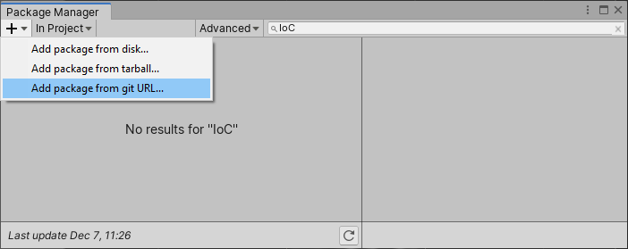
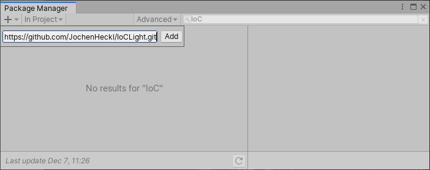
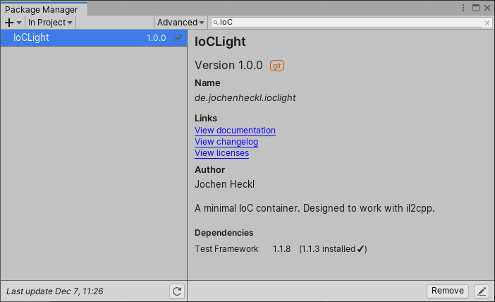

# Getting Started

## Prerequisites

This getting started guide will assume basic knowledge of Unity 2019.3 as well as basic understanding of the Inversion of Control principle.

## Add A Reference to IoCLight

*either* manually:
- Open *manifest.json* in a text editor. You can find the file in the *Packages* directory of your current project
- Add the line `"de.jochenheckl.ioclight":"https://github.com/JochenHeckl/IoCLight.git"` to the "dependencies" section.
- Save the file and return to unity

*or* via UI:
- Open the package manager window in unity
- Click the + button and choose "Add package from git URL..."



- Insert `https://github.com/JochenHeckl/IoCLight.git` into the edit field



- Click the Add button and wait for the project to import




## Start using IoCLight
- Open a new scene.
- Create an empty GameObject and rename it Bootstrap
- Create a new script named ExampleBootstrap.
- Derive class ExampleBootstrap from BootstrapBase.
- Implement the abstract base method `void Compose()`.
- Use `Container.Register()` to bootstrap your IoC Container.


## Simple Example the covers a lot of basic use cases
```cs 
public interface ISimpleInterface
{
	int SimpleProperty { get; }
}

public interface ISimpleTypeDependency
{
	int SimpleProperty { get; }
}

public class SimpleTypeDependency : ISimpleTypeDependency
{
	public int SimpleProperty { get { return 42; } }
}

public class SimpleType : ISimpleInterface
{
	public int SimpleProperty { get { return dependency.SimpleProperty; }; }

	private ISimpleTypeDependency dependency;
	
	public SimpleType( ISimpleTypeDependency dependencyIn )
	{
		dependency = dependencyIn;
	}
}

public class ExampleBootstrap : BootstrapBase
{
    override void Compose()
    {
        Container.Register<SimpleTypeDependency>().As<ISimpleTypeDependency>();
		Container.Register<SimpleType>().As<ISimpleInterface>();
    }

    public void Start()
    {
		// ISimpleInterface will resolve to SimpleType.
		// SimpleType's dependency to ISimpleTypeDependency will be resolved automatically.

		var simpleValue = Container.Resolve<ISimpleInterface>().SimpleProperty;

		// simpleValue is now 42.
    }
}
```
